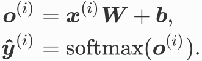
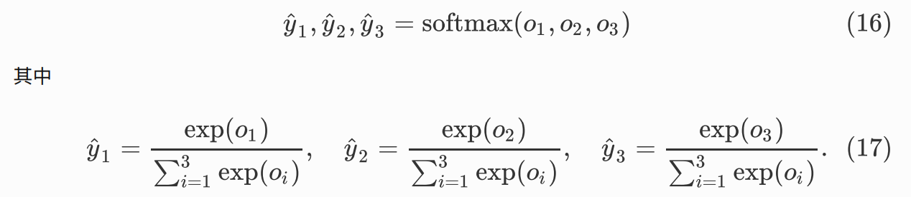
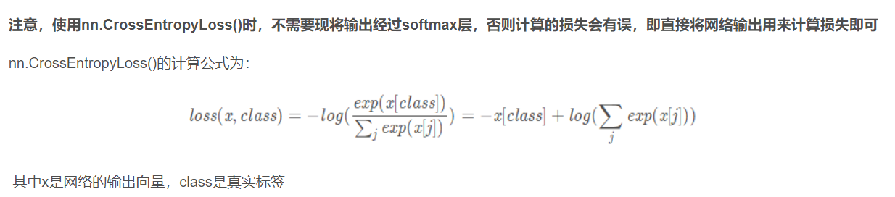

# 基础知识

## 1.批量归一化

批量归一化只要是指对全连接层/卷积层做归⼀化

BatchNorm1d和BatchNorm2d都需要num_features参数值
`nn.BatchNorm1d(120) # 用于全连接层`
`nn.BatchNorm2d(6) # 用于卷积层`

在pytorch中可以直接把BatchNorm加入网络模块,案例代码如下:

```python
net = nn.Sequential(
    nn.Conv2d(1, 6, 5), # in_channels, out_channels,kernel_size
    nn.BatchNorm2d(6),
    nn.Sigmoid(),
    nn.MaxPool2d(2, 2), # kernel_size, stride
    nn.Conv2d(6, 16, 5),
    nn.BatchNorm2d(16),
    nn.Sigmoid(),
    nn.MaxPool2d(2, 2),
    d2l.FlattenLayer(),
    nn.Linear(16*4*4, 120),
    nn.BatchNorm1d(120),
    nn.Sigmoid(),
    nn.Linear(120, 84),
    nn.BatchNorm1d(84),
    nn.Sigmoid(),
    nn.Linear(84, 10)
    )
```

## 2.梯度

### 2.1 梯度计算

```python
x = torch.ones(2, 3, requires_grad=True)
print(x)
out1 = x.mean() # out1 = x.sum()
out1.requires_grad_(True)
out1.backward()
print(x.grad) # out对x求梯度:d(out)/dx

out2 = x.mean()
x.grad.data.zero_() # 梯度清0
out2.backward()
print(x.grad) # out对x求梯度
```

### 2.2 梯度清零

调用loss.backward()函数计算(向后传播,求导函数)之前都要将梯度清零，因为如果梯度不清零，pytorch中会将上次计算的梯度和本次计算的梯度累加。

```python
# param.grad.data.zero_()
loss = ~
optimizer = torch.optim.Adam(model.parameters(),lr=lr)
optimizer.zero_grad()
loss.backward()
```

### 2.3 梯度下降(优化)

optimizer优化器就是需要根据网络反向传播的梯度信息来更新网络的参数，以起到降低loss函数计算值的作用

固定搭配:

```python
# param.grad.data.zero_()
loss = ~
# torch.optim.SGD/Adagrad/RMSprop/Adadelta/Adam
optimizer = torch.optim.Adam(model.parameters(),lr=lr)
optimizer.zero_grad() 
loss.backward()
grad_clipping(model.parameters(), clipping_theta, device) # 梯度修剪
optimizer.step() # 更新所有的参数
```

## 3.Softmax

Softmax回归跟线性回归⼀样将输⼊特征与权重做线性叠加,与线性回归的⼀个主要不同在于,Softmax回归的输出值个数等于标签⾥的类别数.所一Softmax回归的输出层也是⼀个全连接层.
Softmax将输出值变换成**值为正且和为1**的概率分布.




`loss = nn.CrossEntropyLoss()`包含了Softmax运算和交叉熵损失计算


## 4.Other

### 4.1 矩阵拼接

```python
# X = torch.randn(1,2,2,2) # 4维随机数
X = torch.tensor([
[1,1,1],
[2,0,2],
[2,0,2]]) 
Y = torch.tensor([
[1,1,0],
[1,0,2],
[2,0,2]])
# matmul函数用于计算张量tensor相乘(即普通的矩阵相乘)
# a = torch.matmul(X,Y) 
# print(X)
# print(a)
# cat和stack,两种拼接,cat不增加维度,stack增加一维
# a = torch.cat((X,Y),dim=1) # dim:选择的方向,0是纵向拼接,1是横向拼接
a = torch.stack((X,Y),dim=2) # dim=0:2x3x3, 1:3x2x3, 2:3x3x2 
print(a)
```

### 4.2 全连接对比

corr2d_multi_in_out_1x1是对两个矩阵的每一个通道进行一维化,相当于:通道数*FlattenLayer(),同时也要两个矩阵各通道的矩阵乘法
conv3不是全连接,输出结果仍然是方阵而不是一维阵

```python
import torch
from torch import nn

# 1
# 多通道全连接 
def corr2d_multi_in_out_1x1(X, K):
    # 计算前需要对数据的形状进行调整(同时XK)
    # 做1x1卷积时，以上函数与之前实现的互相关运算函数corr2d_multi_in_out等价
    c_i, h, w = X.shape
    c_o = K.shape[0]
    X = X.view(c_i, h * w) # 计算前需要对数据的形状进行调整
    K = K.view(c_o, c_i) # 计算前需要对数据的形状进行调整
    Y = torch.mm(K, X) # 全连接层的矩阵乘法
    return Y.view(c_o, h, w) 

# 2
# 全连接层输出(一维化)
class FlattenLayer(nn.Module):
    def __init__(self):
       super(FlattenLayer, self).__init__()
    def forward(self, x): # x shape: (batch, *, *, ...)
       return x.view(x.shape[0], -1)
# 3     
# 卷积核为1的卷积:跨通道的特征整合,特征通道的升维和降维,减少卷积核参数（简化模型）
conv3 = nn.Conv2d(in_channels, out_channels,kernel_size=1, stride=stride) 
```
