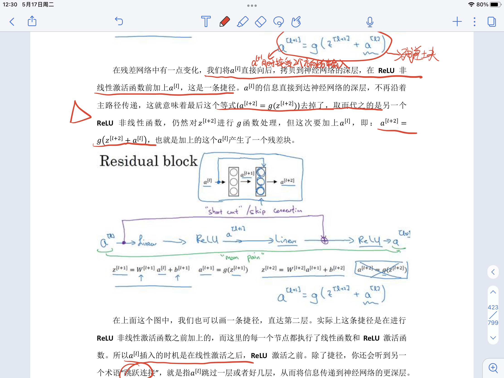

# 残差网络ResNet

## 1.残差块

残差块⾥首先有2个有相同输出通道数的3x3卷积层。每个卷积层后接⼀个批量归⼀化层和ReLU激活函数。然后我们将输⼊跳过这两个卷积运算后直接加在最后的ReLU激活函数前。这样的设计要求**两个卷积层的输出与输⼊形状⼀样**，从⽽可以相加。如果想改变通道数，就需要引⼊⼀个额外的1x1卷积层来将输⼊变换成需要的形状后再做相加运算


```python
import time
import torch
from torch import nn, optim
import torch.nn.functional as F
import sys
sys.path.append("..")
# 残差块的实现如下.它可以设定输出通道数、是否使⽤额外的1x1卷积层来修改通道数以及卷积层的步幅
device = torch.device('cuda' if torch.cuda.is_available() else 'cpu')

# 残差块的实现如下.它可以设定输出通道数、是否使⽤额外的1x1卷积层来修改通道数以及卷积层的步幅
class Residual(nn.Module): # 残差块
    def __init__(self, in_channels, out_channels,use_1x1conv=False, stride=1):
        super(Residual, self).__init__()
        self.conv1 = nn.Conv2d(in_channels, out_channels,kernel_size=3, padding=1, stride=stride)
        self.conv2 = nn.Conv2d(out_channels, out_channels,kernel_size=3, padding=1)
        if use_1x1conv:
            self.conv3 = nn.Conv2d(in_channels, out_channels,kernel_size=1, stride=stride) #核大小为1
        else:
            self.conv3 = None
        self.bn1 = nn.BatchNorm2d(out_channels) # 批量归一化
        self.bn2 = nn.BatchNorm2d(out_channels)
    def forward(self, X):
        Y = F.relu(self.bn1(self.conv1(X))) # 连续两层加权激活
        Y = self.bn2(self.conv2(Y))  # 连续两层加权激活
        if self.conv3:
            X = self.conv3(X)
        return F.relu(Y + X) # 跳跃连接:要求XY输入输出形状一样,才能进行相加

X = torch.rand((4, 3, 6, 6))
# 输⼊和输出形状⼀致的情况
blk = Residual(3, 3)
blk(X).shape # torch.Size([4, 3, 6, 6])
# 在增加输出通道数的同时减半输出的⾼和宽
blk = Residual(3, 6, use_1x1conv=True, stride=2)
blk(X).shape # torch.Size([4, 6, 3, 3])
```

## 2.残差网络构建+MINIST训练

```python
net = nn.Sequential( #最基本的卷积模块
        nn.Conv2d(1, 64, kernel_size=7, stride=2, padding=3),
        nn.BatchNorm2d(64),
        nn.ReLU(),
        nn.MaxPool2d(kernel_size=3, stride=2, padding=1))

def resnet_block(in_channels, out_channels, num_residuals,first_block=False):
    if first_block:
        assert in_channels == out_channels # 第⼀个模块的输出通道数必须同输⼊通道数⼀致
    blk = []
    for i in range(num_residuals): # 每个模块使⽤两个残差块
        if i == 0 and not first_block: 
            # 保证通道数一致
            blk.append(Residual(in_channels, out_channels,use_1x1conv=True, stride=2))
        else:
            blk.append(Residual(out_channels, out_channels)) # 内含两层
    return nn.Sequential(*blk)

# 为ResNet加⼊所有残差模块。这⾥每个模块使用两个残差块
# cjk:可根据个人需要添加多个残差模块
net.add_module("resnet_block1", resnet_block(64, 64, 2, first_block=True))
net.add_module("resnet_block2", resnet_block(64, 128, 2))
net.add_module("resnet_block3", resnet_block(128, 256, 2))
net.add_module("resnet_block4", resnet_block(256, 512, 2))
# 最后，与GoogLeNet⼀样，加⼊全局平均池化层后接上全连接层输出。
net.add_module("global_avg_pool", mymodule.GlobalAvgPool2d()) # GlobalAvgPool2d的输出: (Batch, 512, 1, 1)
net.add_module("fc", nn.Sequential(mymodule.FlattenLayer(),nn.Linear(512, 10))) #最后全连接只输出十个结果(数字)

X = torch.rand((1, 1, 224, 224))
for name, layer in net.named_children():
    # named_children输出各个子module
    X = layer(X) # 遍历每个子模块,进行处理
    print(name, 'output shape:\t', X.shape)

# 在Fashion-MNIST数据集上训练ResNet
batch_size = 256
# 如出现“out of memory”的报错信息，可减⼩batch_size或resize
train_iter, test_iter = mymodule.load_data_fashion_mnist(batch_size,resize=96)
lr, num_epochs = 0.001, 5
optimizer = torch.optim.Adam(net.parameters(), lr=lr)
mymodule.train_ch5(net, train_iter, test_iter, batch_size, optimizer,device, num_epochs)
```
